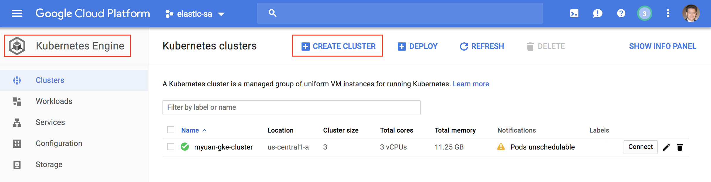
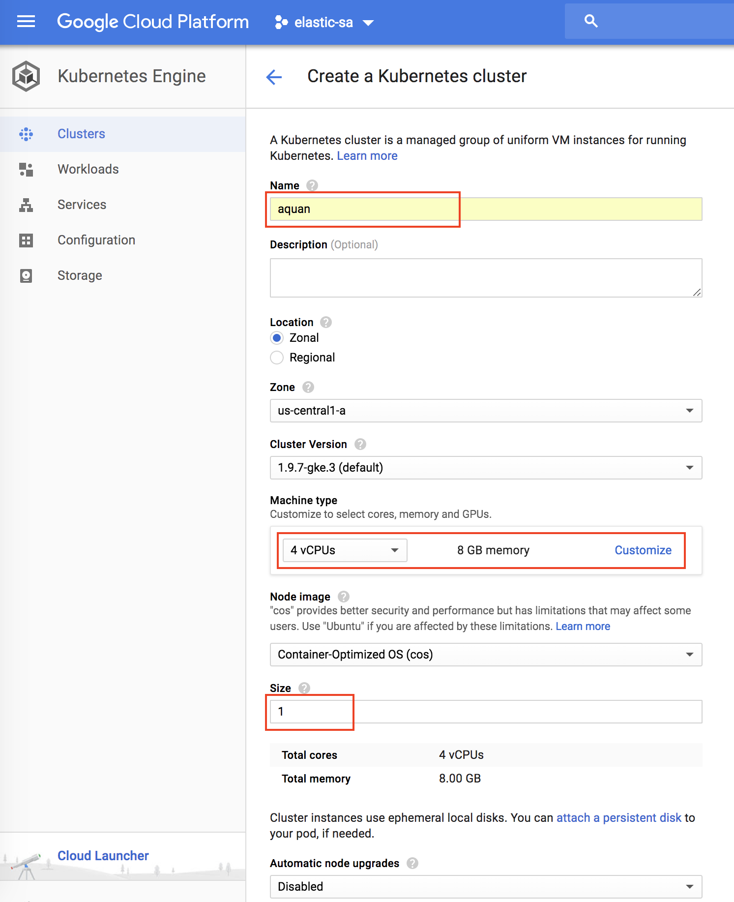
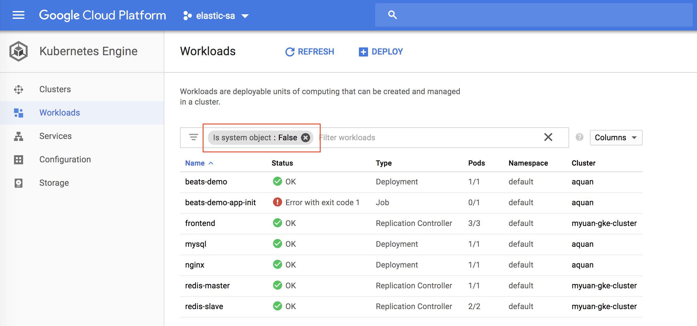
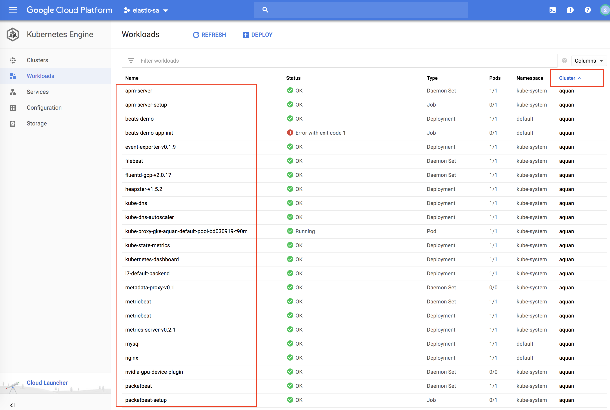
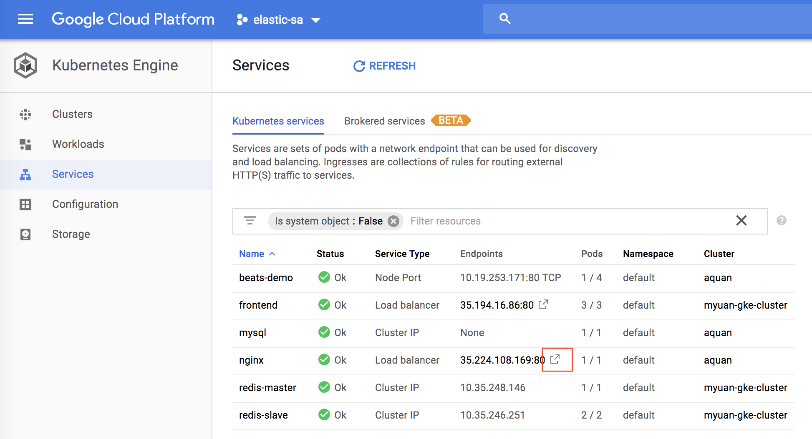
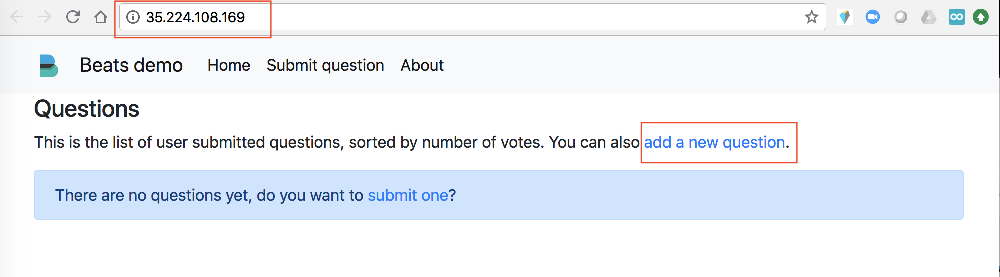
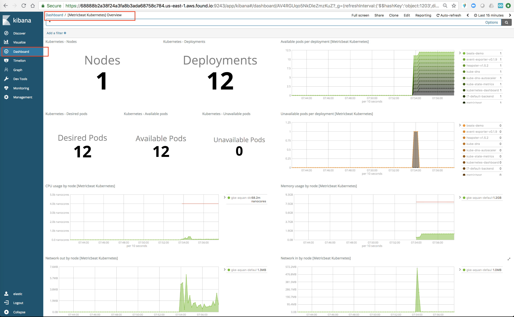
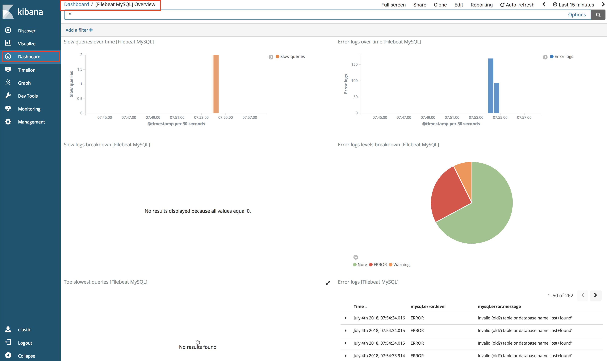
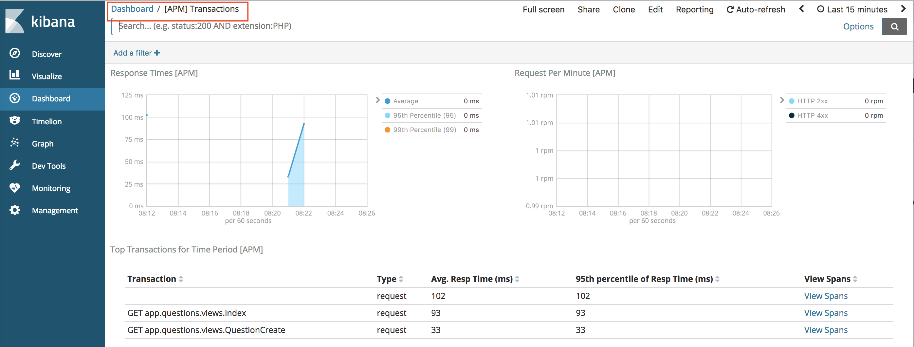

# Oberservable Kuberentes demo using Beats and APM in GCP

1. Create a Kubernetes cluster in GCP using your GCP account. See screenshots below:

Go to the "Kuberentes Engine" page, click on "CREATE CLUSTER":



Give your cluster a name. Configure your "Machine Type" as "4vCPUs, 8GB of memory". You will have to use the customize option to be able to do this. 2vCPUs also works but does not perform well. Change the cluster size to "1" to reduce cost. Click on "Create". Your 1-node cluster should be ready in a few minutes.



2. Install Googl Cloud SDK by following this documentation: https://cloud.google.com/sdk/install

3. Install kubectl by following this documentation: https://kubernetes.io/docs/tasks/tools/install-kubectl/

4. Setup your local environment using the following command. Make sure everything matches your cluster. "aquan" is the name of my Kubernetes cluster. "adam.quan@elastic.co" is my GCP account ID.

```
gcloud config set project elastic-sa
gcloud config set compute/zone us-central1-a
gcloud config set container/cluster aquan
gcloud auth login
gcloud container clusters get-credentials aquan --zone us-central1-a --project elastic-sa
kubectl create clusterrolebinding cluster-admin-binding --clusterrole=cluster-admin --user=adam.quan@elastic.co
kubectl create clusterrolebinding adam.quan-cluster-admin-binding --clusterrole=cluster-admin --user=adam.quan@elastic.co
```

5. Change the secretes in the secretes.yaml file to point to your Elastic Cloud Elasticsearch cluster. Make sure you change the host name of the Elasticsearch host and Kibana host to point to your own Elastic Cloud instance. Remember to use the '-n' option during encoding.

```
echo -n 'STRING-TO-ENCODE' | base64
```

6. Deploy everyting using the following command. Wait a few minutes for all the deployments to be done.

```
kubectl apply -f .
```

7. Go to "Workloads" from your GKE console, you should see the list of deployments. You can get ride of the system filter to see all deployments.



This is a list of all of my deployments without the system filter. Make sure you see everthing is up running and healthy.



8. Go to "Services", and click on the icon next to the IP of the nginx service, the application web page should be open.



Here is how the application look like. You can click on "add a new question" link to add a new question, which will be saved into the mysql database.



Fill in a question and your name and click on submit. This will generate some traffic. Feel free to add more questions and click around.


9. Go to your Elastic Cloud Kibana console. Open the "Metricbeat Kuberenetes" dashboard. You should see something like this.



Feel free to explore other dashboards by searching them.


Here is the "Filebeat MySQL" dashboard.



Here is the "APM Transaction" dashboard.



Keep in mind that we do not have APM in the cloud yet. So, you do not see the APM UI from Kibana. However, if you are sending all these data to a local 6.3 cluster, you will have the APM UI.


