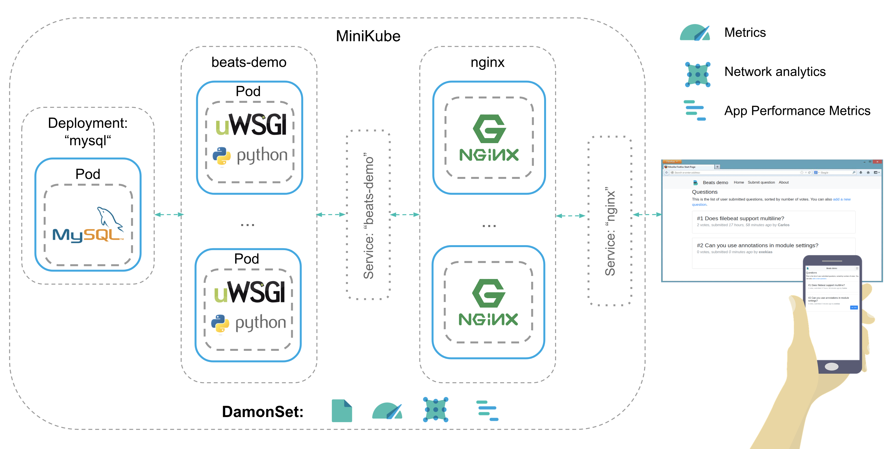
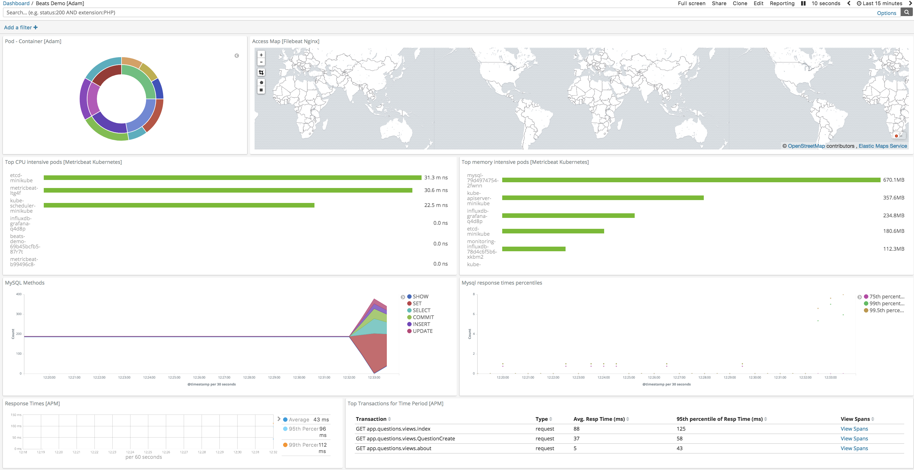
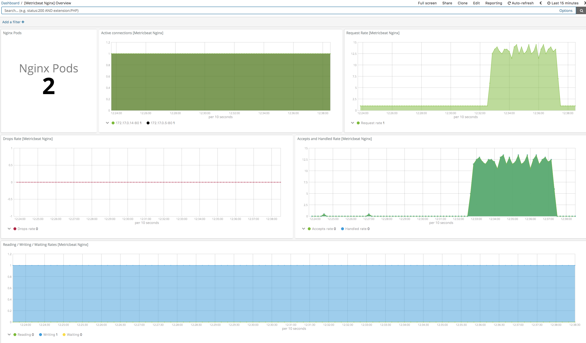

# Oberservable Kuberentes demo using Beats and APM

1. Install minikube
2. Change the secretes in the secretes.yaml file as needed. Remember to use the '-n' option during encoding
3. Deploy everyting using the following command: kubectl apply -f .

Demo Architecture:
-----------------

Example Dashboard:
-----------------

